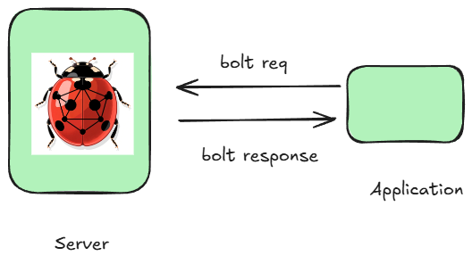

The graph database landscape has long been divided between heavyweight enterprise solutions and lightweight embedded options, forcing developers to choose between power and simplicity. LadybugDB changes this equation by bringing the widely-adopted [Bolt network protocol](https://en.wikipedia.org/wiki/Bolt_(network_protocol))—popular across the graph database ecosystem—to an embedded database architecture. 

[Bolt4rs](https://github.com/LadybugDB/bolt4rs) is a proof of concept wrapper around LadybugDB to demonstrate these ideas. More work is needed to make this into a production ready wrapper. But all the basic pieces are there.

By supporting Bolt, LadybugDB allows applications to speak the same language as enterprise graph databases while maintaining the zero-configuration, file-based deployment model that makes embedded databases so attractive. This means developers can start with LadybugDB embedded directly in their application and seamlessly transition to distributed graph solutions as their needs grow, all without rewriting their query layer or client code.![]](../../../public/img/2025-11-13-bolt/bolt.png)
By supporting Bolt, LadybugDB allows applications to speak the same language as enterprise graph databases while maintaining the zero-configuration, file-based deployment model that makes embedded databases so attractive. This means developers can start with LadybugDB embedded directly in their application and seamlessly transition to distributed graph solutions as their needs grow, all without rewriting their query layer or client code.